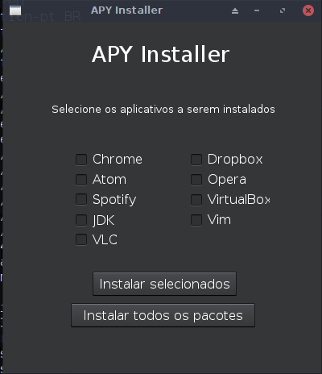

# APY Installer :wrench:
[](https://opensource.org/licenses/BSD-3-Clause)

Programa que facilita a instalação de ferramentas úteis em sistemas Linux (Debian-like).

## Programas disponíveis

- [X] Chrome
- [X] Opera
- [X] Atom
- [X] Vim
- [X] Spotify
- [X] JDK
- [X] VirtualBox
- [X] Dropbox
- [X] VLC

## Uso

Para fazer a utilização do programa é necessário ter:
- Python >= 3.4
- PyQt5

OBS: Suporte apenas para plataformas 64 bits

## Instalação do PyQt

Utilize o seguinte comando para fazer a instalação
```shell
sudo apt-get update
sudo apt-get install python3-pyqt5
```

Após instalar o PyQt5, basta executar o programa da seguinte forma: <code>cd apy-installer && python3 app.py</code>

OBS: O comando python pode mudar de acordo com suas configurações

## Exemplo


O aplicativo foi testado no Debian 8 e no Mint 18.2
